# Budget Planner Architecture Diagram (Mermaid)

## Complete Microservices Architecture

```mermaid
graph TB
    subgraph "External Access"
        Browser[🌐 Web Browser<br/>User Interface]
    end
    
    subgraph "Kubernetes Cluster - budget-planner namespace"
        subgraph "Load Balancing & External Access"
            NodePort[🔌 NodePort Service<br/>Port 30000]
            HPA1[📈 Budget HPA<br/>2-10 replicas]
            HPA2[📈 Auth HPA<br/>2-10 replicas]
        end
        
        subgraph "Application Layer"
            BudgetService[💼 Budget Service<br/>Flask App + Web UI<br/>Port 5000<br/>Jinja2 + Bootstrap + Chart.js]
            AuthService[🔐 Auth Service<br/>Flask App + JWT<br/>Port 5001<br/>bcrypt + Rate Limiting]
        end
        
        subgraph "Data Layer"
            MongoDB[(🗄️ MongoDB<br/>Port 27017<br/>Document Database)]
            PVC[(💾 PersistentVolumeClaim<br/>1Gi Storage<br/>Data Persistence)]
        end
        
        subgraph "Infrastructure"
            ConfigMap[⚙️ ConfigMap<br/>App Configuration]
            Secret[🔑 Secret<br/>MongoDB Credentials]
            K8sDNS[🌐 Kubernetes DNS<br/>Service Discovery]
        end
    end
    
    %% External Access Flow
    Browser -->|HTTP/HTTPS<br/>Port 30000| NodePort
    NodePort -->|Load Balance| BudgetService
    
    %% Authentication Flow
    BudgetService -->|JWT Verification<br/>Internal API| AuthService
    AuthService -->|User Data<br/>CRUD Operations| MongoDB
    
    %% Data Operations Flow
    BudgetService -->|Budget/Expense Data<br/>CRUD Operations| MongoDB
    
    %% Infrastructure Connections
    BudgetService -.->|Configuration| ConfigMap
    AuthService -.->|Configuration| ConfigMap
    MongoDB -.->|Credentials| Secret
    MongoDB -->|Persistent Storage| PVC
    
    %% Scaling Connections
    HPA1 -.->|Auto Scale| BudgetService
    HPA2 -.->|Auto Scale| AuthService
    
    %% Service Discovery
    BudgetService -.->|DNS Resolution| K8sDNS
    AuthService -.->|DNS Resolution| K8sDNS
    MongoDB -.->|DNS Resolution| K8sDNS
    
    %% Styling
    classDef external fill:#e1f5fe,stroke:#01579b,stroke-width:2px
    classDef app fill:#e8f5e8,stroke:#2e7d32,stroke-width:2px
    classDef data fill:#f3e5f5,stroke:#7b1fa2,stroke-width:2px
    classDef infra fill:#f5f5f5,stroke:#424242,stroke-width:2px
    classDef loadbalancer fill:#fff3e0,stroke:#ef6c00,stroke-width:2px
    
    class Browser external
    class BudgetService,AuthService app
    class MongoDB,PVC data
    class ConfigMap,Secret,K8sDNS infra
    class NodePort,HPA1,HPA2 loadbalancer
```

## Service Communication Flow

## Data Flow Architecture

```mermaid
flowchart TD
    subgraph "User Interface Layer"
        UI[🌐 Web Interface<br/>HTML + CSS + JavaScript<br/>Bootstrap + Chart.js]
    end
    
    subgraph "API Gateway Layer"
        API[🔌 REST API<br/>Flask Routes<br/>JWT Middleware]
    end
    
    subgraph "Business Logic Layer"
        Auth[🔐 Authentication<br/>JWT + bcrypt<br/>Rate Limiting]
        Budget[💼 Budget Management<br/>CRUD Operations<br/>Data Validation]
    end
    
    subgraph "Data Access Layer"
        DB[(🗄️ MongoDB<br/>Collections:<br/>users, budgets, expenses)]
        Cache[⚡ Session Cache<br/>Flask Sessions<br/>JWT Tokens]
    end
    
    subgraph "Infrastructure Layer"
        K8s[☸️ Kubernetes<br/>Deployments + Services<br/>HPA + PVC]
        Monitor[📊 Monitoring<br/>Health Checks<br/>Logging]
    end
    
    UI -->|HTTP Requests| API
    API -->|Route to| Auth
    API -->|Route to| Budget
    Auth -->|User Data| DB
    Budget -->|Budget/Expense Data| DB
    Auth -->|Session Data| Cache
    Budget -->|Session Data| Cache
    DB -->|Persistent Storage| K8s
    Cache -->|Memory Storage| K8s
    K8s -->|Health Monitoring| Monitor
    
    classDef ui fill:#e3f2fd,stroke:#1976d2,stroke-width:2px
    classDef api fill:#e8f5e8,stroke:#388e3c,stroke-width:2px
    classDef business fill:#fff3e0,stroke:#f57c00,stroke-width:2px
    classDef data fill:#f3e5f5,stroke:#7b1fa2,stroke-width:2px
    classDef infra fill:#f5f5f5,stroke:#616161,stroke-width:2px
    
    class UI ui
    class API api
    class Auth,Budget business
    class DB,Cache data
    class K8s,Monitor infra
```

## Deployment Architecture

## Security Architecture

